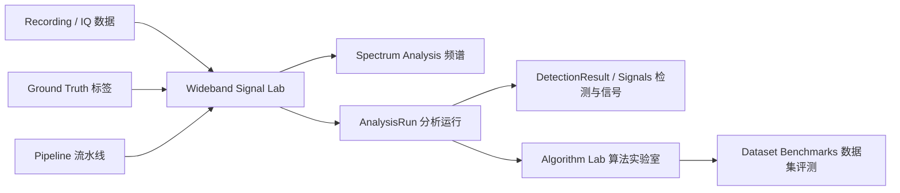

# Wideband Signal Lab 用户说明书

> **适用对象**：项目负责人、课题组同学、信号算法研究人员，以及第一次使用本平台、不熟悉代码实现的用户。
> **适用版本**：Stable V1 UI
> **稳定 UI 基准**：`feature/v1-core` @ `9a6f0feac0b0e6e2ac8ecd65d2e4383479e09f7c`
> **文档生成日期**：2026-09-07
>
> **重要说明**：本文主体只描述当前稳定 V1 UI 中**已经可以操作**的功能。正在开发的 M9.1 Remote GPU 能力（远端 SSH 执行、远端 runner、SpaceNet 远端解析、ZoomSpec 实时推理等）在文中被单独标注为「开发中」，不构成稳定操作步骤。

---

## 1. 这是什么平台

Wideband Signal Lab 是一个**本地运行的宽带 IQ 信号分析工作台**。它把「读入一份宽带 IQ 数据 → 看时频图 → 跑分析流水线 → 得到检测结果 → 对比算法」这条链路，做成了一个可以在浏览器里点击操作的软件。

一句话概括它的定位：

> **输入信号，看结果；比较算法，出指标。**

它面向的是**离线分析**（offline）场景，不依赖云服务、不需要 GPU。你可以在自己电脑上导入一段 IQ 数据，立即看到它的频谱、跑检测、查看检测到的信号，并用评价指标比较不同算法的表现。

当前稳定版本重点回答四类问题：

- 这段 IQ 数据长什么样？（频谱 / 时频图）
- 里面有哪些信号？（检测 / DetectionResult）
- 检测到的信号细节是什么？（波形、FFT、时间频率坐标）
- 两个算法在同一个数据上，谁表现更好？（对比 + 指标）

---

## 2. 不看代码，应该怎样理解平台

### 输入 → 系统 → 输出

把平台当成一个黑盒，你只需要关心「放进去什么」和「拿出来什么」。



- **输入**：一段 IQ 数据（Recording）、可选的 Ground Truth 标签、一个分析流水线（Pipeline）。
- **系统**：平台负责读数据、生成频谱、执行流水线、把结果标准化成统一的检测坐标、并做算法比较与数据集评测。
- **输出**：频谱图、检测框、信号列表、信号详情、分析运行记录、以及一串评估指标（Precision/Recall/F1/AP 等）。

你不需要关心这些结果内部是怎么算出来的——你要做的只是：**导入数据 → 选流水线 → 点运行 → 看结果 → 比较**。

---

## 3. 5分钟 Quick Start

> 下面命令按项目 `README.md` 与 `frontend/package.json` 整理；本文档任务本身未在本次运行环境中实际执行启动验证，如遇端口占用等差异请参考「常见问题与 Troubleshooting」一节。

平台由**两个进程**组成，必须先启动后端，再启动前端。

### 第 1 步：准备 Python 环境（一次性）

在项目根目录打开 PowerShell：

```powershell
cd D:\LGFiles\Wideband Signal Analysis Platform\Wideband-Intelligent-Signal-Analysis-Platform
python -m venv .venv
.\.venv\Scripts\Activate.ps1
python -m pip install -e ".\backend[dev]"
```

> 如果电脑上已经有一个装好依赖的 `.venv`（例如团队机器），可以跳过安装，直接用它启动后端。

### 第 2 步：启动后端

```powershell
cd D:\LGFiles\Wideband Signal Analysis Platform\Wideband-Intelligent-Signal-Analysis-Platform
.\.venv\Scripts\python.exe -m uvicorn app.main:app --app-dir backend --reload
```

看到类似 `Uvicorn running on http://127.0.0.1:8000` 即成功。**不要关闭这个窗口。**

### 第 3 步：启动前端（另开一个终端）

```powershell
cd D:\LGFiles\Wideband Signal Analysis Platform\Wideband-Intelligent-Signal-Analysis-Platform\frontend
npm install
npm run dev
```

看到 `Local: http://127.0.0.1:5173/` 即成功。**不要关闭这个窗口。**

### 第 4 步：打开浏览器

访问 `http://127.0.0.1:5173`，会自动进入 **Recordings** 页面。

### 第 5 步：走完一条最短分析流程

1. 在 Recordings 页点击 **Import Recording**，填：
   - Recording name：`demo-01`
   - Sample rate (Hz)：`1000000`
   - Center frequency (Hz)：`2441000000`
   - IQ file：选一个 `complex64`（小端，`.bin/.iq/.dat`）文件
   - Label space：保持 `spacenet_14`
2. 点击 **Import**，会自动跳到 **Spectrum Analysis** 页，看到频谱图。
3. 保持流水线为 `Dummy Pipeline`，点击 **Run Analysis**。
4. 等待状态变成 `completed`，频谱图上出现一个青色检测框，右侧 **Detected Signals** 列表出现一条结果。
5. 点击该结果 → **View Details**，进入 **Signal Detail** 页查看波形与 FFT。

到此，你已经完成了「导入 → 频谱 → 分析 → 检测 → 详情」的完整闭环。

---

## 4. 使用平台前需要认识的核心对象

以下术语在 UI 中保持英文原文，本说明书用中文解释。

### Recording

平台中一份**待分析的宽带 IQ 数据记录**。

- 从哪来：手动导入（`complex64` 小端文件），或注册 SpaceNet 数据集时按元数据批量生成。
- 和谁有关：一条 Recording 可以产生多条 AnalysisRun 和对应检测；可以带有 Ground Truth。
- 为什么关心：所有分析都依附于一条 Recording。平台按它保存采样率、中心频率、时间/频率范围等物理坐标。

### Ground Truth

**标注好的「正确答案」**：某段时空范围内实际存在什么信号（时间范围 + 频率范围 + 类别）。

- 从哪来：注册 SpaceNet 数据集时自动从标签文件导入。
- 和谁有关：和 Recording 一一对应，用于评估检测结果。
- 为什么关心：没有 Ground Truth 就无法做算法对比和评测；手动导入的 Recording 默认**没有** Ground Truth。

### Pipeline

一种**分析流水线**：输入 Recording（的 IQ 段），输出检测结果。稳定 UI 提供两条：

| Pipeline | 用途 | 说明 |
|---|---|---|
| `Dummy Pipeline` | 链路验证 / 教学演示 | 确定性输出一条固定检测（`BLE LE1M`），不依赖真实算法 |
| `STFT Energy Detector` | 真实 DSP 检测 | 用 STFT 能量检测做「检测/定位」，只回答「这里有信号」，**不做 14 类识别** |

### AnalysisRun

一次**具体的分析执行记录**：某条 Recording × 某个 Pipeline 的一次运行。

- 生命周期：`pending` → `running` → `completed`；异常会变为 `failed`/`interrupted`。
- 和谁有关：属于一条 Recording；完成后产生若干 DetectionResult。
- 为什么关心：它是「信号列表」「详情」「算法对比」的上下文入口；所有结果都挂在某个 AnalysisRun 上。

### DetectionResult

**一次检测到的信号**，用统一物理坐标表示（时间起止 `s` + 频率起止 `Hz` + 类别 + 置信度）。

- 从哪来：Pipeline 执行完成后写入。
- 和谁有关：属于某个 AnalysisRun → 属于某条 Recording。
- 为什么关心：它是你最终要看的「信号」；Signal / Signal Detail 页面展示的就是它。

### Signal

UI 对单个 DetectionResult 的称呼。Signals 页面列出某个 AnalysisRun 的所有检测结果。

### Analysis Package

**外部算法产生的标准结果包**（ZIP，内含 `manifest.json` 和 `detections.json`）。可以从 Recordings 页的 **Import Existing Run** 导入，把 AutoDL/GPU 服务器上算出的结果导入平台查看和比较。

### Dataset Benchmark / DatasetEvaluation

对整个数据集（一批 Recording）的**整体评测**。不是看单条数据，而是看「这个算法在整个数据集上 AP 是多少、每个类别表现如何」。

---

## 5. 使用者需要懂到什么程度

### 你需要知道的

- **一条 Recording 是什么**：一份 IQ 数据，带有采样率、中心频率、时间/频率范围。
- **采样率（Sample rate, Hz）**：每秒采多少个点。导入时必须填。
- **中心频率（Center frequency, Hz）**：信号所在的射频中心。导入时必须填。
- **频率范围 / 时间范围**：频谱图横轴是时间、纵轴是频率；检测框用「时间起止 + 频率起止」描述。
- **Ground Truth**：正确答案；对比/评测的前提。
- **Detection / class / confidence**：一次检测的结果、它的类别名、以及置信度百分比。
- **AnalysisRun**：一次流水线执行。
- **IoU**：两个框的重合程度，平台固定用 **0.5** 阈值判定是否「匹配上」。
- **Precision / Recall / F1**：定位精度的基本指标（见「平台里的指标怎么看」）。
- **AP50 / mAP50 / mAP50:95**：数据集评测里用到的平均精度指标（见「平台里的指标怎么看」）。

这些概念够你看懂结果、向课题组汇报即可；不需要成为信号处理教材。

### 你暂时不需要知道的

- React / TypeScript / Vite 的内部实现
- FastAPI 路由与 ASGI 细节
- SQLAlchemy / SQLite 表结构
- 流水线的具体 CNN / STFT 参数
- 模型训练代码

如果算法对你来说是黑盒，你只需要理解：

> **输入（Recording）→ Pipeline → 输出（DetectionResult）**

---

## 6. 平台完整工作流（真实存在的链路）

以下场景均可在稳定 UI 中实际走通：

- **场景 A 查看一份宽带 IQ 数据**：Recordings 页 → 卡片 → **Open Spectrum**。
- **场景 B 查看 Spectrum**：进入 Spectrum Analysis 页即显示 STFT 时频图；可缩放/平移/读数。
- **场景 C 执行分析 Pipeline**：在 Spectrum Analysis 页选 Pipeline → **Run Analysis** → 等待 `completed`。
- **场景 D 查看 Detection / Signals**：Spectrum 页右侧列表，或 **View All** 进入 Signals 页。
- **场景 E 查看 Signal Detail**：Signals 页 **View Details**，或 Spectrum 页列表 **View Details**。
- **场景 F 导入外部 Analysis Package**：Recordings 页 → **Import Existing Run** → 选 ZIP → **Import** → **Open Results**。
- **场景 G 比较两个 AnalysisRun**：Algorithm Lab → Case Analysis → 选 Recording、Run A、Run B → **Compare**。
- **场景 H 查看 Ground Truth 与算法结果**：Spectrum 页勾选 **Ground Truth** 复选框（仅当该 Recording 有 GT 时可用）；Algorithm Lab 的频谱会同时叠加 GT 与预测。
- **场景 I 单 Recording 的 Case Analysis**：Algorithm Lab 只选 Run A（或 Run A+Run B）看逐 GT 匹配情况。
- **场景 J Dataset Benchmarks**：Algorithm Lab → Dataset Benchmarks 标签页，创建/运行/查看整个数据集的评测。
- **场景 K 从 Dataset Benchmark drill-down 回单样本**：评测详情 → 某个 Evaluation Item → **Inspect**，会切到 Case Analysis 并带上该样本的两个结果。

---

## 7. Recordings（录音库）

### 页面用途

管理平台里的全部 Recording：导入新数据、注册数据集、查看已有数据。

### 如何进入

侧边栏 **Recordings**，或访问 `http://127.0.0.1:5173/recordings`。

### 页面组成

- 顶部：标题、三个按钮（**Register SpaceNet Dataset**、**Import Existing Run**、**Import Recording**）。
- 主体：Recording 卡片列表（每张卡显示名称、数据格式、采样率、中心频率、时长、数据集标签、是否有 Ground Truth）。
- 底部：**Load More**（超出 50 条时加载更多）。

### 所有可交互元素

| 元素 | 操作 | 结果 |
|---|---|---|
| **Import Recording** | 打开导入对话框 | 填名称/采样率/中心频率/文件后点 Import，成功后跳到该 Recording 的 Spectrum 页 |
| **Register SpaceNet Dataset** | 打开注册对话框 | 填服务器本地数据集路径，注册后把该数据集所有样本按元数据登记为 Recording，返回 Created/Skipped/Invalid 汇总 |
| **Import Existing Run** | 打开导入包对话框 | 导入一个 Analysis Package ZIP（见 Import 章节） |
| 卡片上的 **Open Spectrum** | 点击 | 跳到该 Recording 的 Spectrum Analysis 页 |
| **Load More** | 点击 | 追加下一页 Recording |

### 页面输入

依赖后端已有的 Recording 列表（无前置上下文）。

### 页面输出

一份可用的 Recording 列表；通过 Open Spectrum 进入分析。

### 常见空状态 / 错误状态

- 没有任何 Recording：显示 `No recordings imported yet` 空状态。
- 导入的文件不是小端 `complex64`：后端报错 `Only complex64_le is supported`，需换文件。
- 注册路径不存在 / 无 `.json` 标签：返回注册汇总（invalid 计数 > 0）。

### 相关页面

- **Open Spectrum** → Spectrum Analysis
- **Import Existing Run** → 导入成功后跳 Spectrum（带该 run 的结果）

---

## 8. Spectrum Analysis（频谱分析）

### 页面用途

一条 Recording 的「主战场」：查看 STFT 时频图、叠加 Ground Truth / 预测框、启动分析流水线、浏览检测结果。

### 如何进入

Recordings 卡片 **Open Spectrum**；或侧边栏 **Spectrum Analysis**（会先回到 Recordings，需再选一个 Recording）。

### 页面组成

- 标题区：Recording 名称、Fs/Fc/时长。
- 工具栏：STFT 选择器、Pipeline 下拉框、**Run Analysis** 按钮。
- 显示区：频谱图（Spectrogram Viewer）+ 右侧 **Detected Signals** 列表。
- 复选框：**Prediction**（预测框开关）、**Ground Truth**（GT 框开关，仅当有 GT 时可用）。
- 状态标签：当前 AnalysisRun 状态（`pending`/`running`/`completed`/`failed`）；失败时显示错误信息。

### 所有可交互元素

| 元素 | 操作 | 结果 |
|---|---|---|
| Pipeline 下拉框 | 选择 `Dummy Pipeline` 或 `STFT Energy Detector` | 决定这次分析用什么算法 |
| **Run Analysis** | 点击 | 创建 AnalysisRun，按钮变 `Analyzing...`，前端每秒轮询直到 `completed` 或 `failed` |
| **Prediction** 复选框 | 勾选/取消 | 显示/隐藏预测框 |
| **Ground Truth** 复选框 | 勾选/取消 | 显示/隐藏 GT 框（虚线框） |
| 频谱图滚轮 | 滚动 | 缩放（1×–8×） |
| 频谱图拖拽 | 按住拖动 | 平移视图 |
| 频谱图鼠标悬停 | 移动 | 右下角显示当前 时间(s) · 频率(MHz) |
| **Reset View** | 点击 | 恢复缩放为 1× |
| 检测框（频谱上） | 点击 | 选中该检测，右侧列表高亮 |
| 右侧列表项 | 点击 | 选中并高亮对应检测框 |
| 列表项 **View Details** | 点击 | 跳转 Signal Detail |
| 列表上方 **View All** | 点击 | 跳转 Signals 页（该 run 的全部检测） |

### 操作结果

- 运行分析：创建 AnalysisRun，完成后频谱图出现该 run 的预测框，右侧出现检测列表。
- 选择不同流水线再点 Run：生成**另一条** AnalysisRun，两者可在 Algorithm Lab 中对比。

### 页面输入

- Recording（必选）
- Pipeline（可选，默认 Dummy）
- 可选：某个已完成的 AnalysisRun（通过 URL `?run=<runId>` 直接定位，例如从别的页面跳回）

### 页面输出

- 一条（或多条）AnalysisRun
- 每条 run 的 DetectionResult 列表与频谱叠加

### 常见空状态 / 错误状态

- Recording 或频谱加载失败：显示 `Unable to open spectrum workspace`。
- 选了不支持 CPU 的流水线：Run 按钮禁用（当前两条都支持 CPU，正常不会出现）。
- 运行失败：状态标签变 `failed`，下方显示错误信息；可在后端终端看到 worker 日志。

### 相关页面

- **View Details** → Signal Detail
- **View All** → Signals
- 切换到其它 Recording → 回到 Recordings

---

## 9. Signals（信号列表）

### 页面用途

列出某个 AnalysisRun 的**全部检测信号**，用表格展示并支持筛选排序。

### 如何进入

Spectrum 页右侧 **View All**；或访问 `/signals/<runId>`。侧边栏 **Signals** 点击会回到 Recordings（需要先有一个 runId）。

### 页面组成

- 标题：`Signals` + 当前 run 的 ID。
- 按钮：**Show in Spectrum**（跳回 Spectrum 页并定位该 run）。
- 表格列：ID、Signal Type、Confidence、Center Freq、Bandwidth、Time、Duration、操作。

### 所有可交互元素

| 元素 | 操作 | 结果 |
|---|---|---|
| **Signal Type** 列筛选 | 点击列头下拉，按类别过滤 | 表格只剩该类别的信号 |
| **Confidence** 列排序 | 点击列头 | 按置信度升序/降序 |
| **View Details** | 点击 | 跳转该检测的 Signal Detail |
| **Show in Spectrum** | 点击 | 跳回 Spectrum 页并加载该 run（`?run=`） |

### 页面输入

- AnalysisRun ID（必选，来自 URL 或跳转）

### 页面输出

该 run 的所有 DetectionResult，可按类别过滤、按置信度排序。

### 常见空状态 / 错误状态

- run 无检测：表格为空（正常，例如检测器没检出）。
- 加载失败：`Unable to load signals`。
- 无 Recording 上下文时 **Show in Spectrum** 按钮禁用。

### 相关页面

- **View Details** → Signal Detail
- **Show in Spectrum** → Spectrum Analysis

---

## 10. Signal Detail（信号详情）

### 页面用途

深入查看**单个检测信号**：局部频谱上下文、FFT、I/Q 波形、以及其物理坐标摘要。

### 如何进入

Signals 页 **View Details**，或 Spectrum 页列表 **View Details**；访问 `/signals/<runId>/<detectionId>`。

### 页面组成

- 标题：`Signal Detail · <detectionId>` + **Show in Spectrum** 按钮。
- **SignalSummary**：类型、置信度、中心频率、带宽、时间范围、时长。
- **Local Spectrogram Context**：局部频谱图（含该检测框与 GT 叠加）。
- **FFT / Spectrum**：该检测时段的频域幅度曲线（dB，横轴 MHz）。
- **I/Q Waveform**：该检测时段的 I（实线）与 Q（虚线）波形（横轴 ms）。
- **Processing Inspector**：占位卡片，显示「中间产物可选，当流水线导出时在此出现」。

### 所有可交互元素

| 元素 | 操作 | 结果 |
|---|---|---|
| **Show in Spectrum** | 点击 | 跳回 Spectrum 页并定位到该检测（`?run=&selected=`） |
| 频谱图缩放/平移/悬停 | 同 Spectrum 页 | 查看局部上下文 |

### 页面输入

- AnalysisRun ID + DetectionResult ID（均来自 URL）

### 页面输出

一个信号的完整物理画像：在哪（时间/频率）、多强（FFT）、长什么样（I/Q 波形）、属于什么类型。

### 常见空状态 / 错误状态

- 加载失败：`Unable to load signal detail`。
- 无 FFT / 波形（数据缺失）：页面会一直转圈（依赖三个请求全部成功）。

### 相关页面

- **Show in Spectrum** → Spectrum Analysis

---

## 11. Algorithm Lab（算法实验室）

Algorithm Lab 是平台的「对比与评测中心」，包含两个标签页：**Case Analysis**（单样本案例分析）和 **Dataset Benchmarks**（数据集评测）。

### Case Analysis

回答的问题：**在某一条 Recording 上，算法到底错在哪里？**

#### 如何进入

侧边栏 **Algorithm Lab** → 默认进入 Case Analysis。

#### 页面组成

- **Experiment Setup** 卡片：Recording 下拉框、Run A、VS、Run B、**Compare** 按钮。
- 结果区（选择两个不同 run 后）：
  - 两张 **RunMetricsCard**（A/B）：Localization 的 Precision/Recall/F1/Mean IoU、TP/FP/FN、Classification（on matched）的 matched/correct/wrong/accuracy 与混淆列表、End-to-End（class-aware）指标。
  - 两张频谱对比面板（Run A 蓝色 / Run B 绿色，各叠加 GT 与预测框）。
  - **Case Comparison** 表格：每个 GT 一行，显示 Run A / Run B 是否命中、IoU、类别对错、总体 Comparison 标签。

#### 所有可交互元素

| 元素 | 操作 | 结果 |
|---|---|---|
| Recording 下拉（可搜索） | 选择 | 加载该 Recording 的 completed run 列表 |
| Run A / Run B 下拉 | 选择 | 选两个不同 run 后才能 Compare |
| **Compare** | 点击 | 运行对比，展示指标卡片与逐 GT 表格 |
| Case Comparison 表格某一行 | 点击 | 高亮该 GT，并在左右频谱上同步选中匹配的预测框 |
| 只选 Run A（不选 Run B） | — | 显示单 run 检视 + 提示「Select Run B to compare」 |

#### 页面输入

- Recording（可选，可搜索）
- 两个 **已 completed** 的 AnalysisRun（Run A ≠ Run B）

#### 页面输出

- 每个 run 的定位/分类指标
- 逐 GT 的命中情况（IoU + 类别对错）
- 两 run 在频谱上的直观对比

#### 常见空状态 / 错误状态

- Recording 没有 GT：无法做有意义的对比（对比依赖 Ground Truth）。
- 该 Recording completed run 少于两个：显示提示 `This recording has fewer than two completed AnalysisRuns to compare`。
- 网络/接口错误：红色 Alert 可关闭。

#### 相关页面

- 表格行选中 → 频谱高亮
- Dataset Benchmarks 里的 **Inspect** 会跳到这里并自动带好 Recording / Run A（/Run B）

### Dataset Benchmarks

回答的问题：**一个算法在整个数据集上整体表现如何？**

#### 如何进入

Algorithm Lab → 切到 **Dataset Benchmarks** 标签页。

#### 页面组成

- 列表：Name、Pipeline、Dataset、Protocol、Coverage（已评/应评）、Status、mAP50:95、Action。
- 列表行复选框（仅 completed 可选，最多选 2 个）：选中 2 个后出现 **Compare Selected**。

#### 所有可交互元素

| 元素 | 操作 | 结果 |
|---|---|---|
| **New Benchmark** | 点击 | 打开创建面板（见下） |
| Action 按钮 | 随状态变化 | `pending` → **Run**；`running` → **View Progress**；`completed` → **Open**；`failed/interrupted` → **Retry** |
| 行复选框 | 勾选 2 个 completed | 出现 **Compare Selected** |
| **Compare Selected** | 点击 | 展示两评测的指标差值表（Δ B-A）与逐 Recording 对比入口 |

#### New Benchmark 创建面板

1. **Imported Analysis Batch** 下拉：选择一个已导入的分析批次（来自后端 batch import；无批次则下拉为空）。
2. **Resolve**：解析该批次 → 显示 已解析/缺失/冲突 计数与 Manifest SHA256。
3. 填 **Benchmark Name**。
4. **Create & Run**：创建评测并立即运行（只有 Resolved=Expected 且 Missing=0、Conflict=0 时才可点）。

> 创建评测依赖「已导入的分析批次」。稳定 UI 没有「上传批次 ZIP」的入口，批次来自后端 `POST /api/imported-runs/batch`（见「容易遗漏的已实现功能」与「当前状态与能力边界」）。

#### Benchmark 详情（completed）

- 顶部指标：End-to-End Class-aware mAP50:95、mAP50、Localization AP50:95、Matched Accuracy。
- **Ground Truth Provenance**：Raw annotations / Evaluation GT / 去重数 / 去重策略。
- **Localization**、**Classification on Matched**、**End-to-End** 三张指标卡。
- **Per-Class Metrics** 表（可按 AP50:95 排序）。
- **Top Classification Confusions** 表（按 count 降序）。
- **Protocol & Provenance** 折叠面板：协议名、Manifest SHA256、Pipeline、协议配置 JSON。
- **Evaluation Items** 表：每个样本的 Recording、GT 数、预测数、所属 AnalysisRun、**Inspect** 按钮。

#### 页面输入

- 一个或多个 DatasetEvaluation（backend 数据）
- 创建时需要一个已解析的 imported batch

#### 页面输出

- 整个数据集的 mAP / AP 指标
- 每类指标
- 混淆矩阵
- 样本级 drill-down

#### 常见空状态 / 错误状态

- `pending`/`running`：显示状态、阶段、Coverage，每秒轮询。
- `failed`/`interrupted`：显示错误类型/信息 + **Retry**。
- completed 但无 aggregate：`Completed benchmark has no aggregate metrics`。

#### 相关页面

- 详情里某个 Evaluation Item 的 **Inspect** → 切到 Case Analysis（带 recording + run）
- **Compare Selected** → 比较面板 → **Open Case Comparison** → Case Analysis（带 A/B 两个 run）

---

## 12. Settings（设置）

**当前为占位页面**。进入后只显示一句说明文字：`V1 keeps runtime configuration intentionally minimal.`（V1 刻意保持最小配置）。

它**不是**完整的配置中心——不要期望在这里改数据库、远端或模型配置。

---

## 13. Import 与外部算法结果

### 导入外部 Analysis Package（单包）

- **入口**：Recordings 页 → **Import Existing Run**。
- **文件**：ZIP，须包含 `manifest.json` 和 `detections.json`（Analysis Package v1 格式）。
- **步骤**：选择一个目标 Recording（用来承载结果）→ 选 ZIP → **Import** → 成功后显示 run 信息 → **Open Results** 跳回 Spectrum 查看。
- **结果去哪看**：导入会创建一条 `executor=imported`、状态 `completed` 的 AnalysisRun，并写入对应 DetectionResult；可在 Spectrum / Signals 查看。

### 后端 Batch Import（批次导入）

- 端点：`POST /api/imported-runs/batch`。
- **当前稳定 UI 没有上传入口**；该端点由后端/脚本使用，用于把一批结果导入并生成「Imported Benchmark Batch」，供 Dataset Benchmarks 的 New Benchmark 选择。

### 常见失败原因

- ZIP 缺少 `manifest.json` / `detections.json`。
- manifest 或检测内容不符合 schema（如置信度超出 0..1、坐标越界、类别不匹配）。
- 选择的 Recording 与包内 label_space / 坐标不匹配。

---

## 14. 平台里的指标怎么看

以下指标全部来自稳定 UI 实际展示。

### 定位指标（Localization）

| 指标 | 一句定义 | 高/低意味着什么 |
|---|---|---|
| **TP / FP / FN** | 真正例 / 假正例 / 假负例 | 数值组合起来能看出「漏检多」还是「误检多」 |
| **Precision** | 检出的框里，真的有多少比例 | 高 = 误检少 |
| **Recall** | 该检出的框里，检出了多少比例 | 高 = 漏检少 |
| **F1** | Precision 与 Recall 的调和平均 | 高 = 两者均衡且都好 |
| **Mean IoU** | 匹配上的框平均重合度 | 高 = 框画得准 |

> 平台用固定 **IoU=0.5** 判定一个预测是否匹配某条 Ground Truth。

### 分类指标（Classification on matched）

- **Matched / Correct / Wrong**：匹配上的样本数、类别判对数、判错数。
- **Matched Accuracy**：匹配样本中的类别准确率。

### 端到端 / 类别感知指标（Class-aware）

- **Class-aware P / R / F1**：把「定位 + 类别都正确」才算对的计算口径。
- **mAP50**：类别感知平均精度的 AP@0.5。
- **mAP50:95**：在 IoU 0.5 到 0.95 多个阈值上的平均精度（汇报时最常用的总指标）。
- **Localization AP50 / AP50:95**：只看定位（不计类别对错）的平均精度。

### 建议理解口径

- 汇报「算法整体好不好」：看 **mAP50:95**。
- 汇报「定位准不准」：看 **Localization AP50:95**、Mean IoU。
- 汇报「类认不认得准」：看 **Matched Accuracy**、混淆矩阵。
- 汇报「某个 Recording 上错在哪」：看 Case Analysis 的逐 GT 表格。

---

## 15. 平台用了哪些技术，它们分别负责什么

按真实项目依赖整理（`frontend/package.json`、`backend/pyproject.toml` 与源码 import）。

### 前端

| 技术 | 在平台里承担的角色 |
|---|---|
| React + TypeScript | 负责浏览器中用户看到和操作的界面 |
| Vite | 开发时提供本地网页服务器（`localhost:5173`），负责前端构建 |
| Ant Design (antd) | 提供按钮、表格、下拉框、弹窗、表单等现成 UI 组件 |
| react-router-dom | 负责页面路由（Recordings / Spectrum / Signals / ... 之间的跳转） |
| 自绘 SVG（无第三方图表库） | 频谱图、波形图、FFT 图均由组件直接画 SVG 实现 |

### 后端

| 技术 | 在平台里承担的角色 |
|---|---|
| FastAPI | 接收 UI 请求、组织数据、调用分析流程并返回结果（REST API） |
| Pydantic | 校验接口输入/输出的数据结构 |
| SQLAlchemy | 操作数据库的 ORM |
| SQLite | 保存 Recording、AnalysisRun、DetectionResult、DatasetEvaluation 等平台状态（本地 `platform.db`） |
| Uvicorn | 本地跑 FastAPI 的服务器 |

### 信号 / 算法

| 技术 | 在平台里承担的角色 |
|---|---|
| NumPy | 读写 IQ、数值计算 |
| SciPy | STFT 等信号处理 |
| Matplotlib | 生成频谱图等图片 |
| 平台自带 Pipeline | `DummyPipeline`（确定性演示）、`STFTEnergyDetectorPipeline`（能量检测） |

> 稳定 V1 **不依赖 PyTorch**。任何需要 PyTorch / GPU 的模型推理（如 ZoomSpec）属于「研究算法 / 开发中远程 GPU 能力」，不是稳定 UI 的必需依赖。

### 执行 / 存储

| 技术 | 在平台里承担的角色 |
|---|---|
| subprocess | 分析任务在独立 Python 子进程中执行，前端通过轮询查结果 |
| 本地文件系统 | 原始 IQ 存 `data/recordings/`，产物/频谱缓存存 `data/` 下其它目录 |
| ZIP / JSON | Analysis Package 的导入格式 |

---

## 16. 一次操作背后发生了什么（面向用户的简化版）

### 打开一条 Recording 的频谱

1. 用户在 Recordings 点 Open Spectrum。
2. 前端请求后端「该 Recording + 频谱元数据」。
3. 后端找到 Recording、按需读取 IQ 段并生成 STFT 频谱。
4. 前端拿到图片地址与物理坐标，绘制时频图。

### 运行一次分析

1. 用户选 Pipeline，点 Run Analysis。
2. 后端创建一条 AnalysisRun（状态 `pending`），随后在子进程里执行该 Pipeline。
3. 流水线读 IQ、做计算、产出 DetectionResult（统一时间/频率坐标）。
4. 完成后 AnalysisRun 变 `completed`，前端轮询到后刷新频谱上的预测框。

### 对比两个 run

1. 用户在 Algorithm Lab 选 Recording、Run A、Run B。
2. 后端按 IoU=0.5 把两个 run 的检测与 Ground Truth 匹配。
3. 返回每个 GT 的命中情况、每个 run 的 P/R/F1、类别对错与混淆。

---

## 17. 容易遗漏的已实现功能

> 本节由代码审计（路由、页面控件、API client、后端路由）得出。以下功能都在稳定 UI 中，但不容易被第一次使用的用户发现。

1. **频谱图的缩放 / 平移 / 读数**
   在 Spectrum 与 Signal Detail 的频谱图上：滚轮缩放、拖拽平移、悬停读 时间·频率、**Reset View**。藏得很深，但非常有用。
2. **Prediction / Ground Truth 叠加开关**
   Spectrum 页的两个复选框。尤其 **Ground Truth** 只有在录音有 GT 时才出现可用状态。
3. **Signals 页的筛选与排序**
   按 Signal Type 筛选、按 Confidence 排序，是信号列表最常用的操作。
4. **Signal Detail 的 Show in Spectrum**
   一键跳回频谱并精确定位到该检测（通过 URL 参数实现），方便在全局时频图里看上下文。
5. **Case Analysis 的单 run 检视**
   只选 Run A 不选 Run B 也能看该 run 的预测叠加（会提示再选一个来对比）。
6. **Case Comparison 表格点行联动**
   点击表格某一行，左右两张频谱会同步高亮对应的预测框。表格单元格同时显示 IoU 与类别对错（✓/✗）。
7. **Dataset Benchmarks 的 Compare Selected**
   勾选两个 completed 评测后出现的对比：指标差值表（Δ B-A），并可进一步选一个样本做 Case Comparison。
8. **Per-Class 指标表排序 + 混淆矩阵**
   详情页 per-class 表可按 AP50:95 排序；混淆矩阵已按 count 降序。
9. **从 Benchmark drill-down 回单样本（Inspect）**
   评测详情的 Evaluation Items → **Inspect**，直接切到 Case Analysis 并带好上下文，是「整体 → 单个样本」的闭环入口。
10. **Benchmark 列表 Action 随状态变化**
    pending→Run、running→View Progress、completed→Open、failed/interrupted→Retry，一个按钮完成状态流转。
11. **Import Existing Run**
    在 Recordings 页，不在一级导航里；导入外部 ZIP 结果包后一键 Open Results 看频谱。
12. **Register SpaceNet Dataset**
    在 Recordings 页；只登记元数据不拷贝数据，幂等（重复注册会显示 Skipped）。
13. **AnalysisRun 状态轮询与失败展示**
    Spectrum 页每秒自动轮询；失败时状态标签下方直接显示错误信息。

---

## 18. 第一次使用时容易误解的地方

1. **侧边栏点 Spectrum Analysis / Signals 会跳回 Recordings**
   这不是按钮坏了。这两个页面需要先有 Recording（/run）上下文，所以点击后先回到录音库让你选对象。真正的进入方式是：Recordings 卡片 **Open Spectrum**，再到 Spectrum 页 **View All / View Details**。
2. **手动导入的 Recording 没有 Ground Truth**
   因此 Algorithm Lab 对比、Dataset Benchmarks 都做不了有意义的评测。只有注册 SpaceNet 数据集才会带 GT。
3. **STFT Energy Detector 不是 14 类识别器**
   它只做「检测/定位」（输出 `Signal` 类），不告诉你这是 WiFi 还是 LoRa。14 类识别属于研究算法，稳定 UI 未提供。
4. **每条分析产生一条新的 AnalysisRun**
   想对比就用同一 Recording 跑两条（选不同 Pipeline 或不同时间），再到 Algorithm Lab 选 Run A / Run B。
5. **Spectrum 页右上角的 `completed` 标签指当前 run**
   如果页面停留了很久，那个标签是你上次选中的 run 的状态；重新点 Run Analysis 会创建新 run。
6. **Dataset Benchmarks 的 New Benchmark 需要「已导入的分析批次」**
   稳定 UI 没有上传批次 ZIP 的按钮；下拉为空是正常现象，除非后端已经导入了批次。
7. **Signal Detail 的 Processing Inspector 是占位卡片**
   只有流水线导出中间产物时才会有内容，稳定流水线默认不会显示。

---

## 19. 常见问题与 Troubleshooting

| 现象 | 可能原因与处理 |
|---|---|
| 打开 `localhost:5173` 白屏 / 连不上 | 前端没起来。检查前端终端是否报错；或端口被占，改用 `npm run dev -- --port 5174` |
| `127.0.0.1:8000` 连不上 | 后端没起来。检查后端终端是否 `Uvicorn running`；端口被占用则换 `--port 8001` 并让前端指向它 |
| `npm run dev` 提示 vite 找不到 | 前端依赖未装，先 `cd frontend && npm install` |
| 后端启动报缺少 `uvicorn` 等依赖 | 虚拟环境未装依赖，执行 `python -m pip install -e ".\backend[dev]"` |
| 导入报 `Only complex64_le is supported` | 上传的不是小端 `complex64` 的 IQ 文件，换文件或按要求生成 |
| 点 Run Analysis 后变 `failed` | 到后端终端看 worker 报错；常见为数据文件缺失/路径问题，修复后重跑 |
| Signals 页提示无法加载 | run 没有检测或后端异常；确认 runId 是否正确 |
| Algorithm Lab 无法 Compare | 需要该 Recording 有 Ground Truth，且至少两条 `completed` run，且 Run A ≠ Run B |
| Dataset Benchmarks 列表为空 | 还没有创建任何评测；需要先有 imported batch 才能 New Benchmark |
| 频谱图全黑 | 数据幅度过小或为空；确认导入的 IQ 文件内容正确 |

---

## 20. 当前状态与能力边界

| 能力 | 当前状态 | 用户是否可直接在 UI 操作 | 说明 |
|---|---|---|---|
| 导入 `complex64` IQ Recording | 已在稳定 UI 中可用 | 是 | Recordings → Import Recording |
| 注册 SpaceNet 数据集 | 已在稳定 UI 中可用 | 是 | 需要本机存在数据集目录；只登记元数据 |
| 查看 STFT 频谱 | 已在稳定 UI 中可用 | 是 | Spectrum Analysis |
| 运行 Dummy / STFT 流水线 | 已在稳定 UI 中可用 | 是 | Run Analysis |
| 查看 Signals / Signal Detail | 已在稳定 UI 中可用 | 是 | 波形、FFT、频谱上下文 |
| 导入单个 Analysis Package | 已在稳定 UI 中可用 | 是 | Recordings → Import Existing Run |
| Case Analysis（双 run 对比） | 已在稳定 UI 中可用 | 是 | 需要 Ground Truth |
| Dataset Benchmarks（创建/运行/查看/比较） | 已在稳定 UI 中可用 | 部分 | 创建依赖后端已导入的 batch；查看/比较/钻取可直接操作 |
| Batch Import（批次导入 ZIP） | 后端已有，UI 未开放 | 否 | `POST /api/imported-runs/batch`，无前端入口 |
| `ground-truth` 写入端点 | 后端已有，UI 未开放 | 否 | UI 只读 GT |
| Settings 配置中心 | 占位页面 | 否 | 仅显示提示文字，不是真实配置中心 |
| Remote GPU 执行 / SSH 传输 / 远端 runner | 开发中（M9.1） | 否 | 正在开发，未接入稳定 UI |
| ZoomSpec 实时推理 | 规划中 / 开发中 | 否 | 冻结流水线实现尚未落地；不属稳定 UI |
| 14 类识别流水线 | 规划中 | 否 | 稳定 UI 只有 Dummy 与 STFT 检测 |

---

## 21. 第一次学习平台的推荐路径（15–30 分钟）

1. **Recordings（2 分钟）**：先导入一条 IQ 数据，理解「一条 Recording = 一份数据」。不要被多个按钮干扰。
2. **Spectrum Analysis（5 分钟）**：看时频图，试试滚轮缩放、勾选 Prediction / Ground Truth。重点理解「横轴时间、纵轴频率、框 = 检测」。
3. **Run Analysis（3 分钟）**：先用 Dummy 跑通，再换 STFT 跑一次。重点理解「一次运行 = 一条 AnalysisRun」。
4. **Signals（3 分钟）**：看这个 run 的全部检测，用类别筛选、置信度排序。
5. **Signal Detail（3 分钟）**：看 FFT 与 I/Q 波形。重点理解「检测 = 一段时间 × 一段频率」。
6. **Algorithm Lab → Case Analysis（5 分钟）**：选两个 run 对比。重点理解 P/R/F1、IoU、逐 GT 表格。**前提**：该 Recording 有 Ground Truth。
7. **Algorithm Lab → Dataset Benchmarks（5 分钟）**：有 imported batch 时创建并跑一个评测，看 mAP50:95 与 per-class 表。

> 前 5 步不需要 Ground Truth，能独立完成；后 2 步依赖带 GT 的数据。

---

## 22. 推荐汇报 Demo 路径（5–10 分钟）

从「输入」讲到「输出 + 评测」，路线如下（按真实 UI 顺序）：

1. **Recordings**（30 秒）：展示一份 SpaceNet 数据集录音（带 Ground Truth 标签）。
2. **Spectrum Analysis**（1 分钟）：展示 STFT 时频图，打开 Ground Truth 叠加（虚线框）。
3. **Run Analysis + Detection**（1.5 分钟）：选流水线运行，出现预测框，对比预测与 GT 的框位置。
4. **Signal Detail**（1 分钟）：点一个检测，展示 FFT 与 I/Q 波形。
5. **Algorithm Lab → Case Analysis**（2 分钟）：选 Run A / Run B 对比，展示 P/R/F1 与逐 GT 命中表。
6. **Dataset Benchmarks**（2 分钟）：打开一个已评测数据集，展示 mAP50:95、per-class 表、混淆矩阵，必要时用 **Inspect** 钻取回单个样本。

> 若现场没有带 GT 的数据，可先用手动导入的 Recording 演示 1–4，再用评测数据演示 5–6。

---

## 23. 完整功能检查清单

> 以下逐项来自稳定 V1 UI 的实际可交互元素。逐项勾选可确认你已经用遍平台全部已开放功能。

- [ ] 打开 Recordings 页面（`/recordings`）
- [ ] 通过 **Import Recording** 导入一条 `complex64` IQ 数据
- [ ] 通过 **Register SpaceNet Dataset** 注册一个数据集（若本机有数据集目录）
- [ ] 通过 **Import Existing Run** 导入一个 Analysis Package ZIP
- [ ] 在卡片上点击 **Open Spectrum** 进入 Spectrum Analysis
- [ ] 在 Spectrum 页切换 Pipeline（Dummy / STFT）
- [ ] 点击 **Run Analysis** 并等待 `completed`
- [ ] 勾选 / 取消 **Prediction** 复选框
- [ ] 勾选 / 取消 **Ground Truth** 复选框（有 GT 时）
- [ ] 在频谱图上滚轮缩放、拖拽平移、悬停读数、**Reset View**
- [ ] 点击频谱上的检测框选中它
- [ ] 在右侧 Detected Signals 列表点击 **View Details**
- [ ] 点击 **View All** 进入 Signals 页
- [ ] 在 Signals 页按 Signal Type 筛选
- [ ] 在 Signals 页按 Confidence 排序
- [ ] 在 Signals 页点击 **Show in Spectrum**
- [ ] 在 Signal Detail 页查看 FFT 与 I/Q 波形
- [ ] 在 Signal Detail 页点击 **Show in Spectrum**
- [ ] 进入 Algorithm Lab → Case Analysis
- [ ] 选择 Recording（可搜索）与 Run A / Run B
- [ ] 只选 Run A 查看单 run 检视
- [ ] 点击 **Compare** 查看 P/R/F1/Mean IoU 与 TP/FP/FN
- [ ] 查看 Classification（on matched）与 Confusions
- [ ] 查看 End-to-End（class-aware）指标
- [ ] 在 Case Comparison 表格点击一行并观察频谱高亮联动
- [ ] 进入 Algorithm Lab → Dataset Benchmarks
- [ ] 查看评测列表的 mAP50:95 与 Coverage
- [ ] 选中两个 completed 评测，点击 **Compare Selected**
- [ ] 在比较面板查看指标差值表（Δ B-A）
- [ ] 在比较面板点击 **Open Case Comparison**
- [ ] 打开某个评测详情，查看 mAP50 / AP50:95 / Matched Accuracy
- [ ] 查看 Ground Truth Provenance
- [ ] 查看 Per-Class Metrics 表并按其 AP50:95 排序
- [ ] 查看 Top Classification Confusions
- [ ] 展开 Protocol & Provenance 折叠面板
- [ ] 在 Evaluation Items 表点击某行的 **Inspect**
- [ ] 打开 Settings 页（确认是占位页）

---

## 附：本文档的准确性边界

- 本文所有功能描述均来自稳定 V1 UI 代码审计（前端页面/组件/API client、后端 router）。
- 标有「开发中」「规划中」的能力（M9.1 Remote GPU、ZoomSpec 推理、Settings 真实配置）**不是**稳定操作步骤。
- 如发现 UI 后续版本与本说明不一致，请以实际运行的稳定分支代码为准。