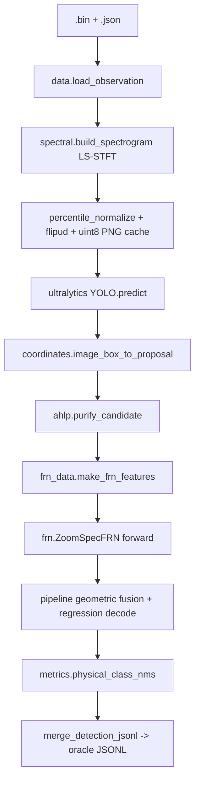

# M9.1 Legacy Frozen Pipeline Source Map

> Forensic, read-only characterization of the historical frozen pipeline
> `zoomspec_yolo26n_aug_combined_frn_v3` version `1.0.0`. Task 11 of M9.1-C.
> This document records what the legacy code actually did, with source
> evidence. It proposes a minimal Task-12 porting boundary but implements
> nothing.

## 1. Evidence identity

- Pipeline id: `zoomspec_yolo26n_aug_combined_frn_v3`
- Pipeline version: `1.0.0`
- Legacy driver that produced the oracle: `/root/autodl-tmp/Claude/scripts/run_test_new_pipeline.py`
- Legacy runtime interpreter: `/root/miniconda3/bin/python` (Python 3.12.3)
- Platform repo branch/HEAD at characterization time: `feature/m9-1-live-remote-gpu-inference`

Evidence convention: `file.py :: function` and optional line range. YAML evidence is `config` + key.

## 2. Historical oracle

- Path: `/root/autodl-tmp/Claude/reports_claude/test_val_detections_augv3.jsonl`
- SHA256: `950ad87ec355169b1904da4364f296ade5854926d4e02dc83049d9585859efcd` (verified)
- Row count: `33373` (verified)
- Split: `test` (SpaceNet advanced/test), manifest `test_manifest.json` (`test_ids` 2500, seed 42)
- This file was produced by `run_test_new_pipeline.py` step 3: `merge_detection_jsonl.py` merging the 4 FRN shard outputs `test_det_shard_augv3_{0..3}.jsonl`.

## 3. Frozen assets

| Logical asset | Absolute path | SHA256 (verified) |
|---|---|---|
| `detector_checkpoint` | `/root/autodl-tmp/Claude/runs/cpn/ls_stft_yolo26n_aug_warm/weights/best.pt` | `eba4fa4b112a0e61cc1013e96f99d1ae82b845f4be1e8b1f80bd2089d1f82311` |
| `frn_checkpoint` | `/root/autodl-tmp/Claude/artifacts/frn_combined_v3_training/best.pt` | `da6087da2fbfbaa5ba0e2cb210d08c24ee8b2af8418329d32216f7c77253be67` |
| `frozen_config` | `/root/autodl-tmp/Claude/configs/frozen_full_pipeline_v26_aug_combined.yaml` | `030dbfa77353f876728252c2f247b47816baf8921a7641bb8873ae9035d9d7ec` |
| `ls_stft_normalization` | `/root/autodl-tmp/ZoomSpec/reports/normalization_ls_stft.json` | `9b994655a279352b835b96cb00cefde89410fc6130458665dca7070de146d72f` |

The tracked asset manifest (Task 10 / Task 11 corrective) records these same logical names + SHAs; absolute paths are deployment config only. The fourth asset `ls_stft_normalization` was added in the Task 11 final corrective because frozen LS-STFT detector input depends on its `value_low` / `value_high` percentile-normalization values.

## 4. End-to-end call graph

```
run_test_new_pipeline.py  (Claude/scripts)
 ├─ step1  ZoomSpec/scripts/evaluate_cpn.py
 │          model=detector_checkpoint  --split test --representation ls_stft --conf 0.003
 │          └─ ultralytics YOLO.predict(source=<cached 640x640 PNGs>, imgsz=640, conf=0.003, iou=0.7, max_det=300, device=0)
 │          └─ zoomspec_repro.coordinates.image_box_to_proposal (normalized pixel -> physical Proposal)
 │          └─ output: test_cpn_proposals_augv3.jsonl  (49,825 rows, 19.93/image)
 ├─ step2  ZoomSpec/scripts/run_frn_on_proposals.py  ×4 shards
 │          checkpoint=frn_checkpoint  --score-mode geometric --score-threshold 0.001 --nms-iou 0.7
 │          └─ zoomspec_repro.pipeline.refine_proposals
 │               ├─ ahlp.purify_candidate          (AHLP per proposal)
 │               ├─ frn_data.make_frn_features     (global_resample, length 4096)
 │               ├─ frn.ZoomSpecFRN forward        (I/Q + FFT dual-domain)
 │               ├─ geometric score fusion         sqrt(proposal_score * signal_prob * class_prob)
 │               ├─ FRN regression decode (start/duration/bandwidth/center_offset)
 │               └─ metrics.physical_class_nms     (class-aware 2D TF NMS, IoU 0.7)
 │          └─ output: test_det_shard_augv3_{0..3}.jsonl  (+ raw shards)
 ├─ step3  ZoomSpec/scripts/merge_detection_jsonl.py
 │          └─ output: test_val_detections_augv3.jsonl  (33,373 rows, sorted by sample_id then -score)
 └─ step4  ZoomSpec/scripts/evaluate_detections.py  (evaluation only, not part of inference)
```

Mermaid form:



## 5. SpaceNet IQ input

Source: `ZoomSpec/src/zoomspec_repro/data.py :: read_interleaved_iq`, `load_observation`, `parse_metadata`.

| Property | Historical value | Source |
|---|---|---|
| `.bin` dtype | float16 little-endian (`<f2`) | `read_interleaved_iq` line 50 |
| byte order | little | `endian="little"` default |
| interleaving | `I,Q,I,Q,...` (even index = I, odd = Q) | lines 53-56 |
| decoded dtype | `complex64` | line 57 |
| number of complex samples | `raw.size // 2` = `.bin` bytes / 4 | line 54 |
| observation freq range | from JSON `observation_range` (MHz → Hz) | `parse_metadata` line 71-90 |
| sample rate `fs_hz` | `f_hi_hz - f_lo_hz` | `load_observation` line 107 |
| center freq | `0.5*(f_lo_hz + f_hi_hz)` | `schema.Observation.center_hz` |
| duration | `iq.size / fs_hz` | `schema.Observation.duration_s` |
| whole-recording processing | whole I/Q vector loaded at once, no segmentation | `load_observation`; STFT frames the whole vector |
| normalization before STFT | none at IQ level (only after spectrogram) | `build_spectrogram` |
| padding/truncation | none on the raw recording | — |
| chunking | STFT frame chunking is internal memory-bounding only (`block_frames=256`), not semantic | `stft_complex` line 30 |

SpaceNetAdapter (current platform) differences: platform uses `byte_size//4` for sample count and `(f_high-f_low)*1e6` for sample rate — numerically identical to legacy. Legacy reads `json_path.with_suffix(".json")`; platform loads via its own `SpaceNetAdapter.load`. Semantics match.

## 6. LS-STFT

Source: `ZoomSpec/src/zoomspec_repro/spectral.py :: stft_complex`, `make_ls_frequency_grid`, `build_spectrogram`, `percentile_normalize`; Torch path `spectral_torch.py`.

For the frozen test run, the image cache was built with `build_cpn_dataset.py` (`--representation ls_stft`, default `--backend numpy`); inference in `evaluate_cpn.py` reads the cached PNGs and uses `make_spectrogram_geometry` (geometry only, no STFT recompute).

| Property | Historical value | Source |
|---|---|---|
| representation | `ls_stft` | config `cpn.representation.name`; `evaluate_cpn.py --representation ls_stft` |
| LS-STFT grid mode | `paper_strict` | config `cpn.representation.mode` (frozen YAML); `make_ls_frequency_grid` |
| output frequency bins | 640 | `output_frequency_bins=640` default |
| output time bins | 640 | `output_time_bins=640` default; config `image_size: [640, 640]` |
| subband width | 1e6 Hz (`subband_hz=1e6`) | `make_ls_frequency_grid` |
| number of subbands M | `round(width/1e6)` e.g. 30/50 for 30/50 MHz observations | line 84 |
| FFT size | 2048 | `n_fft=2048` |
| window length | 2048 | `win_length=2048` |
| hop/stride | 1024 | `hop_length=1024` |
| window function | Hann (`np.hanning`) | `stft_complex` line 41 |
| per-subband bin allocation | even largest-remainder `_allocate_even_bins` | line 54-65 |
| frequency grid formula | paper equations (8)-(12) with monotonic ULP repair | lines 88-114 |
| magnitude/log | `log(|STFT| + epsilon)`, epsilon=1e-8 | `build_spectrogram` line 182 |
| normalization | percentile `[1.0, 99.5]` → `value_low=0.1356358379125595`, `value_high=6.512740135192871` | verified asset `ls_stft_normalization` = `ZoomSpec/reports/normalization_ls_stft.json`; `percentile_normalize` |
| resize/interpolation | time axis resized to 640 via linear interp; freq via complex linear interp | `_resize_time`, `_interp_complex_rows` |
| channel construction | 1 grayscale channel | `build_cpn_dataset.py` line 81 |
| image dtype | uint8 (`round(normalized*255)`) | line 81 |
| vertical flip | `np.flipud` (high freq becomes top of image, y-down) | line 83 |
| detector input dims | 640×640 (uint8 single channel) | config + `imgsz=640` |

Frequency orientation: the LS-STFT grid is ascending frequency (low→high) in array row 0→639; the PNG is flipped with `np.flipud`, so image row 0 (top) = highest frequency. Coordinate mapping in §13 accounts for this.

## 7. Detector / CPN / YOLOv26n

Source: `ZoomSpec/scripts/evaluate_cpn.py :: main`; model loaded via `ultralytics.YOLO`.

| Property | Historical value | Source |
|---|---|---|
| library | Ultralytics YOLO | `from ultralytics import YOLO` line 41 |
| model loader | `YOLO(str(args.model))` | line 50 |
| checkpoint | detector_checkpoint (`ls_stft_yolo26n_aug_warm/weights/best.pt`) | driver + config |
| architecture | YOLOv26n (3 classes: narrow/mid/wide) | config `cpn.model.architecture`; train args |
| detector input shape | 640×640 grayscale uint8 PNG | `imgsz=640`; cache |
| detector output | normalized xyxy (`result.boxes.xyxyn`), confidence, class | lines 93-96 |
| coordinate convention | normalized [0,1] xyxy (x=time, y=frequency, y-down image) | line 94 + `coordinates.image_box_to_proposal` |
| detector classes | 3 bandwidth tiers, NOT 14 signal classes | config `classes: [narrow, mid, wide]` |
| tier edges | `(4e5, 5e6)` Hz | config + `--tier-edges-hz` |
| confidence threshold | 0.003 | driver `--conf 0.003`; config `cpn.inference.confidence` |
| IoU/NMS | iou=0.7, max_det=300 | driver default + config |
| augment/TTA | none at inference (batch predict, verbose=False) | `evaluate_cpn.py` |
| warmup | none at inference | — |
| device | `device=0` (CUDA) | line 70 |
| batch | 16 (bounded chunks) | `--batch 16` |
| inference source | pre-built PNG cache (`artifacts/cpn_ls_stft_test/images/test/*.png`), not live STFT | line 45 |

Pixel→physical conversion: `evaluate_cpn.py` clips normalized box to [0,1], drops degenerate boxes, then calls `coordinates.image_box_to_proposal(sample_id, clipped, artifact, bandwidth_tier, score, image_y_down=True)` → `Proposal` (physical seconds/Hz). The `artifact` is `make_spectrogram_geometry` (geometry only, no IQ read).

Proposals written: `{sample_id, t0_s, t1_s, f0_hz, f1_hz, bandwidth_tier, score}`. Frozen test produced 49,825 proposals (19.93/image).

## 8. AHLP

Source: `ZoomSpec/src/zoomspec_repro/ahlp.py :: purify_candidate`, `design_hamming_lowpass`, `_fft_convolve_same`.

Input: one `Observation` + one `Proposal` (CPN physical box). Output: `PurifiedCandidate` (baseband, low-pass filtered, decimated complex I/Q + crop geometry).

| Parameter | Value | Source |
|---|---|---|
| context_ratio | 0.1 | config `ahlp.context_ratio`; default |
| kappa | 0.2 | config `ahlp.kappa`; `beta = 1 + kappa*(1-proposal.score)` |
| eta (transition ratio) | 0.1 | config `ahlp.eta` |
| order_constant | 3.3 | config `ahlp.order_constant`; `numtaps = ceil(order_constant*fs/transition)` |
| min_numtaps / max_numtaps | 31 / 4095 | config |
| cutoff_scale | 1.0 | `run_frn_on_proposals.py` default `--cutoff-scale 1.0` |
| requested low-pass cutoff | `0.5 * beta * proposal.bandwidth_hz * cutoff_scale` | line 77 |
| window function | Hamming | `design_hamming_lowpass` line 30 |
| decimation | `floor(fs / (2*f_lp))` | line 94 |
| crop expansion | proposal t-extent ± 10% context | lines 64-65 |
| Nyquist guard | `fs/decimation >= 2*f_lp` (validate) | `schema.PurifiedCandidate.validate` |

Purpose (from code behavior): take the CPN's coarse physical box, mix the raw I/Q crop to baseband around the proposal center, low-pass to the proposal's estimated bandwidth (scaled by score-dependent `beta`), decimate — producing a clean, normalized candidate for the FRN classifier/regressor. If `requested_f_lp >= Nyquist`, filtering is skipped (identity taps).

## 9. Combined FRN V3

Source: `ZoomSpec/src/zoomspec_repro/frn.py :: ZoomSpecFRN` (class), `pipeline.py :: load_frn`, `refine_proposals`; features `frn_data.py :: make_frn_features`; bandwidth context `frn_dataset.py :: bandwidth_context`.

### 9.1 Checkpoint identity (USED BY FROZEN PIPELINE)

- Checkpoint: `frn_combined_v3_training/best.pt`, SHA `da6087da…`
- Embedded config (read from checkpoint, weights_only=False):
  - `model.channels=128`, `fusion_attention=True`, `use_bandwidth_context=True`, `use_center_regression=True`
  - `use_log_bandwidth` absent → False (default)
  - `use_attention_pool` absent → False (default)
  - `data.input_length=4096`, `data.classes=14`
- Config file `Claude/configs/frn_combined_v3.yaml` matches (stage `frn_combined_v3_final`).
- Loader: `pipeline.load_frn` reads `checkpoint["config"]` and `checkpoint["model"]`, then `.eval()`.

### 9.2 Input construction

| Property | Value | Source |
|---|---|---|
| AHLP candidate → features | `make_frn_features(candidate, output_length=4096, feature_mode="global_resample")` | `run_frn_on_proposals.py` defaults |
| feature_mode | `global_resample` (linear resample to 4096) | default; multiwindow NOT used by frozen run |
| I/Q rows | `[real, imag]` of RMS-normalized complex signal, shape (2, 4096) | `frn_data.py` lines 62-67 |
| FFT row | `fftshift(FFT)/sqrt(N)`, `log1p|.|`, then mean/std standardized, shape (1, 4096) | lines 68-69, 84-91 |
| bandwidth context scalar | `log2(f_lp/1e6)` | `frn_dataset.bandwidth_context` |
| model input tensors | `iq (B,2,4096)`, `fft (B,1,4096)`, `bw_context (B,)` | `pipeline.refine_proposals` lines 71-78 |
| dtype / autocast | float16 autocast on CUDA | line 73 |

### 9.3 Architecture behavior (inference-relevant)

- `DomainEncoder(2, 128)` for I/Q, `DomainEncoder(1, 128)` for FFT: depthwise stem (stride 4), bidirectional LSTM, local conv, 2× LinearAttention.
- Fusion: concat → 1×1 conv → LayerNorm → GELU → 1×1 conv → `LinearAttentionBlock` (since `fusion_attention=True`).
- Pooling: mean over positions (`use_attention_pool=False`).
- Heads:
  - `start_head`, `duration_head`: 1D conv over the I/Q encoder feature sequence → softmax expectation over [0,1] grid.
  - `bandwidth_head`: 1D conv over FFT features → expectation over [0,1] grid → normalized bandwidth value.
  - `class_head`: Linear over `[pooled, log2(f_lp/1e6)]` (bandwidth context appended).
  - `signal_head`: Linear → 1 logit (background-vs-signal BCE, inference uses sigmoid).
  - `center_head`: Linear → tanh signed residual (`use_center_regression=True`).

### 9.4 Class ordering

Legacy `schema.CLASS_NAMES` (index = class_id):
0 WiFi 20MHz QPSK, 1 WiFi 20MHz 16QAM, 2 WiFi 20MHz 64QAM, 3 WiFi 40MHz QPSK, 4 WiFi 40MHz 16QAM, 5 WiFi 40MHz 64QAM, 6 BLE LE1M, 7 BLE LE2M, 8 Zigbee, 9 LoRa 250kHz, 10 SRRC QPSK, 11 SRRC 16QAM, 12 AM, 13 FM.

Verified identical to platform `label_spaces/spacenet_14.json` (order + names). No mismatch.

## 10. Class ordering

See §9.4. `class_id = argmax(softmax(class_logits))`; mapped to name only for reporting. The oracle JSONL stores numeric `class_id`.

## 11. Confidence semantics

Source: `pipeline.py :: refine_proposals` lines 91-126.

- `class_id = argmax(class_probabilities)`; `class_probability = probabilities[class_id]`.
- `signal_probability = sigmoid(signal_logit)`.
- `conditional = signal_probability * class_probability`.
- Final score (score_mode = `geometric`, from driver):
  `score = sqrt(max(proposal.score * conditional, 0))`
  where `proposal.score` is the CPN detector confidence.
- `product` mode would be `proposal.score * conditional`; the frozen run used `geometric`.
- Survival: `score >= score_threshold (0.001)`, then class-aware physical NMS.

So the final `confidence` is a geometric fusion of detector confidence × FRN signal × FRN class probability. It is neither detector-only nor class-only.

## 12. NMS and filtering

| Stage | Behavior | Source |
|---|---|---|
| Detector NMS | Ultralytics NMS, iou=0.7, max_det=300 | `evaluate_cpn.py` |
| Detector threshold | conf=0.003 | driver |
| Degenerate box reject | drop if clipped x0>=x1 or y0>=y1 | lines 98-100 |
| FRN threshold | score >= 0.001 | driver `--score-threshold 0.001` |
| FRN box reject | skip if `f1 <= f0` after decode | line 114-115 |
| Class-aware NMS | `physical_class_nms(detections, 0.7)` — 2D TF-IoU, grouped by (sample_id, class_id), per-class, greedy by score | `metrics.py` lines 22-36 |
| Duplicate suppression (labels) | exact duplicate GT rows deduped at cache build only (109 in test), not at inference | `build_cpn_dataset.py` line 99 |
| Clipping | time clipped to `[0, duration]`; freq clipped to `[f_lo, f_hi]` | `pipeline.py` lines 103-113 |

Class label participates in NMS: `physical_class_nms` groups by `(sample_id, class_id)`, so NMS is class-aware. This matters for Task-12 parity.

## 13. Physical coordinate transform

Source: `coordinates.py :: image_box_to_proposal`, `_normalized_to_value`, `_grid_edges`; pipeline decode.

Detector output is normalized `xyxy` (x=time, y=frequency, y-down image, [0,1]).

`image_box_to_proposal(box, artifact, image_y_down=True)`:
- `t0 = _normalized_to_value(x0, time_grid)`, `t1 = _normalized_to_value(x1, time_grid)`.
- `f0 = _normalized_to_value(1-y1, freq_grid)`, `f1 = _normalized_to_value(1-y0, freq_grid)` (invert y because image y is down; low frequency is at image bottom).

`_normalized_to_value`: builds pixel edges `edges[1:-1]=midpoints`, `edges[0]=grid[0]-halfstep`, `edges[-1]=grid[-1]+halfstep`, then `edge_index = clip(coord*grid.size, 0, grid.size)`, `value = interp(edge_index, arange(edges.size), edges)`. Extents override the first/last edge (`time_extent_s=[0, duration]`, `frequency_extent_hz=[f_lo, f_hi]` from `make_spectrogram_geometry` diagnostics). This is the "ls_grid_pixel_edges" conversion named in the frozen config.

So the CPN Proposal is already in physical seconds + absolute Hz. The FRN then refines it:
- `t0 = crop_t0 + start_norm * crop_duration`
- `end_norm = min(1-1e-6, start_norm + duration_norm)`; `t1 = crop_t0 + end_norm * crop_duration`
- `t0` clipped to `[0, duration - 1/fs]`; `t1 = min(duration, max(t1, t0+1/fs))`
- `bandwidth_hz = max(bandwidth_norm * 2*f_lp, 1)` (linear mode; the frozen model has `use_log_bandwidth=False`)
- `center_hz = proposal.center_hz + center_offset * 2*f_lp` (center regression enabled)
- `f0 = max(f_lo, center - bw/2)`, `f1 = min(f_hi, center + bw/2)`; skip if `f1<=f0`

Output units: seconds and absolute Hz. No pixel output reaches the final JSONL.

Worked example (oracle row): `{"sample_id":"0","t0_s":0.11296,"t1_s":0.14937,"f0_hz":2446014863,"f1_hz":2448000924,"class_id":8,"score":0.9884}` — already physical; the JSONL never contains pixel or normalized values.

## 14. Historical JSONL output contract

Oracle fields (per row):
- `sample_id` — SpaceNet test file stem (e.g. `"0"`)
- `t0_s`, `t1_s` — time in seconds
- `f0_hz`, `f1_hz` — absolute frequency in Hz
- `class_id` — int in [0,13]
- `score` — final geometric-fusion confidence in [0,1]

Produced by `run_frn_on_proposals.py` lines 72-75. Sorted by `merge_detection_jsonl.py` as `(sample_id asc, -score desc)`. No intermediate scores in the final JSONL (they are in the raw shards, not the oracle).

## 15. Frozen config keys

Config: `/root/autodl-tmp/Claude/configs/frozen_full_pipeline_v26_aug_combined.yaml` (SHA `030dbfa7…`).

| Config key | Value | Used by | Effect |
|---|---|---|---|
| `cpn.representation.name` | `ls_stft` | cache build + `evaluate_cpn --representation ls_stft` | selects LS-STFT |
| `cpn.representation.mode` | `paper_strict` | cache build (`make_ls_frequency_grid`) | LS-STFT frequency grid |
| `cpn.representation.image_size` | `[640, 640]` | cache build | output image size |
| `cpn.representation.n_fft` | 2048 | cache build | FFT size |
| `cpn.representation.win_length` | 2048 | cache build | window length |
| `cpn.representation.hop_length` | 1024 | cache build | hop |
| `cpn.representation.normalization_file` | `reports/normalization_ls_stft.json` (resolved to `/root/autodl-tmp/ZoomSpec/reports/normalization_ls_stft.json`, SHA `9b994655…`) | cache build | percentile normalize (behavior asset `ls_stft_normalization`) |
| `cpn.model.architecture` | `yolo26n` | training (informational) | detector arch |
| `cpn.model.classes` | `[narrow, mid, wide]` | cache build labels | 3 tiers |
| `cpn.model.bandwidth_tier_edges_hz` | `[400000, 5000000]` | cache build + `evaluate_cpn --tier-edges-hz` | tier mapping |
| `cpn.model.weights` | detector_checkpoint path | driver + evaluate | detector weights |
| `cpn.inference.confidence` | 0.003 | evaluate | detector threshold |
| `cpn.inference.nms_iou` | 0.7 | evaluate | detector NMS |
| `cpn.inference.max_det` | 300 | evaluate | max detections |
| `cpn.inference.image_size` | 640 | evaluate | imgsz |
| `cpn.inference.physical_box_conversion` | `ls_grid_pixel_edges` | coordinates | pixel-edge mapping |
| `ahlp.kappa/eta/order_constant/min_numtaps/max_numtaps/context_ratio` | 0.2/0.1/3.3/31/4095/0.1 | `purify_candidate` | AHLP filter design |
| `frn.stage` | `frn_combined_v3` | checkpoint identity | frozen FRN |
| `frn.checkpoint` | frn_checkpoint path | driver | FRN weights |
| `frn.input_length` | 4096 | `make_frn_features` (default) | feature length |
| `frn.classes` | 14 | model | class count |
| `frn.decode.end_norm_clamp` | `min(1-eps, start+duration)`, eps 1e-6 | `pipeline.refine_proposals` | decode clamp |
| `postprocess.score_mode` | `geometric` | driver `--score-mode` | fusion |
| `postprocess.score_threshold` | 0.001 | driver `--score-threshold` | survival |
| `postprocess.physical_class_nms_iou` | 0.7 | driver `--nms-iou` | NMS |
| `official_test.*` | recorded metrics | evaluation/reporting only | not inference |
| `cpn_test_recall.*` | recorded metrics | reporting | not inference |
| `selection_data.*`, `frozen_at_utc` | provenance | documentation | not inference |

PRESENT BUT NOT USED BY FROZEN TEST PATH: `cpn.validation.*` (reported values), `cpn.model.weights` is consumed as a CLI path (same value). `frn.input_length` matches the runtime default; it is not read by `run_frn_on_proposals.py` (the script uses the `input_length` default inside `refine_proposals`). `frn.decode.epsilon` documents the hardcoded `FRN_END_EPS = 1e-6` in `pipeline.py`.

## 16. Runtime dependencies

Verified on the historical runtime interpreter `/root/miniconda3/bin/python` (the `PY` used by the driver):

| Package | Version |
|---|---|
| python | 3.12.3 |
| torch | 2.8.0+cu128 |
| numpy | 2.3.2 |
| scipy | 1.18.0 |
| ultralytics | 8.4.114 |
| Pillow | present (cache build) |
| PyYAML | present (cache build) |

Inference-only path imports: `torch`, `numpy`, `ultralytics`, `PIL` (cache build), `yaml` (cache build), `json`, `math`. `scipy` is not imported by the inference path itself but is part of the runtime environment.

## 17. Used legacy source map

| Stage | Legacy source file | Symbol | Inputs | Outputs | Task-12 destination |
|---|---|---|---|---|---|
| IQ reader | `ZoomSpec/src/zoomspec_repro/data.py` | `read_interleaved_iq`, `load_observation` | `.bin`+`.json` path | `Observation` (complex64 IQ + metadata) | `preprocessing.py` |
| metadata parse | `data.py` | `parse_metadata` | JSON meta | `(f_lo_hz,f_hi_hz), targets` | `preprocessing.py` (non-GT metadata only) |
| LS-STFT | `spectral.py` | `stft_complex`, `make_ls_frequency_grid`, `build_spectrogram`, `percentile_normalize` (normalization values from verified asset `ls_stft_normalization`) | Observation | 640×640 log-magnitude spectrogram | `preprocessing.py` |
| LS-STFT (torch) | `spectral_torch.py` | `build_spectrogram_torch` | Observation | same (Torch backend; cache used numpy) | `preprocessing.py` (optional) |
| geometry | `spectral.py` | `make_spectrogram_geometry` | metadata only | coordinate grids | `preprocessing.py` |
| detector load | `scripts/evaluate_cpn.py` | `YOLO(model)` | checkpoint | YOLO model | `detector.py` |
| detector inference | `evaluate_cpn.py` | `model.predict(...)` | cached PNGs | boxes xyxy/conf/cls | `detector.py` |
| detector postprocess | `evaluate_cpn.py` + `coordinates.py` | clip + `image_box_to_proposal` | boxes | `Proposal` (physical) | `detector.py` |
| AHLP | `ahlp.py` | `purify_candidate` (+ `design_hamming_lowpass`, `_fft_convolve_same`) | Observation+Proposal | `PurifiedCandidate` | `ahlp.py` |
| FRN input | `frn_data.py` | `make_frn_features` (+ `bandwidth_context` in `frn_dataset.py`) | candidate | (2,4096) IQ + (1,4096) FFT + scalar | `frn.py` |
| FRN model load | `pipeline.py` | `load_frn` | checkpoint | `ZoomSpecFRN` eval model | `frn.py` |
| FRN inference | `pipeline.py` | `refine_proposals` | features | class probs + regression outputs | `frn.py` |
| class mapping | `schema.py` | `CLASS_NAMES`, argmax | class_logits | class_id | `frn.py` (reuse platform label space) |
| confidence | `pipeline.py` | geometric fusion | proposal.score, signal_prob, class_prob | final score | `frn.py`/`pipeline.py` |
| physical coord | `pipeline.py` | decode (start/duration/bw/center + clip) | regression outputs | `Detection` (s, Hz) | `pipeline.py` |
| NMS | `metrics.py` | `physical_class_nms`, `tf_iou` | Detections | NMS'd Detections | `pipeline.py` |
| result serialization | `scripts/run_frn_on_proposals.py` | JSONL writer | Detections | oracle JSONL row | `pipeline.py` output assembly |

## 18. Inspected but NOT part of frozen inference

Files under `Claude/` and `ZoomSpec/` that are historical/experimental and must NOT be ported:

- `ZoomSpec/scripts/train_cpn.py`, `train_frn.py`, `finetune_frn.py`, `build_*_frn_dataset.py`, `match_cpn_proposals.py`, `sweep_*`, `freeze_*` — training/experiment scripts
- `ZoomSpec/scripts/evaluate_detections.py`, `evaluate_oracle_frn.py`, `evaluate_cpn.py` (its proposal output is used, but the recall-eval portion is not needed for parity) — evaluation
- `ZoomSpec/src/zoomspec_repro/metrics.py::evaluate_map` — evaluation-only AP
- `ZoomSpec/src/zoomspec_repro/audit.py`, `proposal_selection.py`, `dfine_adapter.py` — utilities / D-FINE experiment
- `ZoomSpec/scripts/build_dfine_coco.py`, `run_dfine_*`, `smoke_dfine_model.py` — D-FINE experiment (NOT used)
- All `Claude/scripts/analyze_*.py`, `augment_iq.py` + augmented cache builders, `plot_*`, `run_*_chain.sh`, RT-DETR experiments — analysis/training
- `Claude/artifacts/frn_*` alternative FRN training dirs, `frn_predicted_*`/`frn_oracle_*` checkpoints — alternative experiments, NOT the frozen v3 combined path
- `Claude/configs/frozen_full_pipeline_rtdetr_l_combined_v3.yaml` — RT-DETR experiment (different CPN)
- Legacy old checkpoint names (`yolo11n`, `frn_oracle_v1`, etc.) — superseded

## 19. No-GT-leakage audit

- During cache build, GT (`obs.targets`) is used to write YOLO label files (training labels). For the TEST cache, labels are written but the test path only reads the images; `evaluate_cpn.py` reads GT only for the *recall evaluation report*, not to produce proposals.
- During FRN inference (`run_frn_on_proposals.py` → `refine_proposals`), the Observation's `targets`/metadata are NOT used to construct features or scores. `purify_candidate` uses only `proposal` + `observation.iq` + `observation.fs/f_lo/f_hi/center/duration`. `make_frn_features` uses only the AHLP candidate.
- GT is used by `evaluate_detections.py` only to score the final detections (evaluation, post-hoc).
- Conclusion: **A. GT used only for evaluation** (and for training labels at cache build); **B. GT does NOT construct or modify inference predictions**. No architectural blocker. Task 12 may accept raw IQ + non-label metadata only.

## 20. Legacy vs platform contract

| Concern | Legacy behavior | Platform required behavior | Porting implication |
|---|---|---|---|
| IQ path | legacy reads `<dataset_dir>/<id>.bin` + JSON | `RecordingInput` (id/data_path/data_format/metadata) | resolve via Task-9 resolver; read raw .bin bytes |
| dataset lookup | direct filesystem by stem | logical SpaceNet (split, key), resolver-validated | use `resolve_space_net` |
| GroundTruth access | `Observation.targets` present (used for eval/labels) | RecordingInput has NO GT; GT only for identity | exclude GT from inference input |
| pipeline output | `Detection` (s, Hz, class_id, score) | `DetectionPayload` (s, Hz, class_id/name, confidence, scores) | map Detection→DetectionPayload |
| coordinate units | seconds + absolute Hz | same | direct |
| class mapping | 14-class legacy order == platform spacenet_14 | canonical label space | reuse platform label space; verified identical |
| confidence | `sqrt(proposal_score*signal_prob*class_prob)` | `confidence` in [0,1] | preserve exact geometric fusion |
| asset paths | hardcoded absolute paths in configs | injected/configured, not in Git | asset manifest (Task 10) + deployment config; 4 assets including `ls_stft_normalization` |
| checkpoint loading | `torch.load(..., weights_only=False)` | load via configured paths, verify hashes | use Task-10 verified paths |
| config loading | YAML + embedded checkpoint config | explicit config params | port the frozen values as constants/defaults |
| result serialization | JSONL rows (sample_id, t0/t1_s, f0/f1_hz, class_id, score) | Analysis Package v1 + DetectionResult rows | reuse M9 adapter/exporter patterns |

## 21. Minimal Task-12 porting boundary

Proposed smallest code surface (no implementation in Task 11):

- `preprocessing.py` — `read_interleaved_iq`, `parse_metadata` (non-GT), `stft_complex` + `make_ls_frequency_grid` + `build_spectrogram` + `percentile_normalize` (LS-STFT, paper_strict, 640×640), `make_spectrogram_geometry`. **LS-STFT normalization must come from the VERIFIED `ls_stft_normalization` asset identity** (`value_low=0.1356358379125595`, `value_high=6.512740135192871`); do not copy values from an unverified legacy path.
- `detector.py` — `YOLO` loader + `predict(imgsz=640, conf=0.003, iou=0.7, max_det=300)` + `image_box_to_proposal` (normalized xyxy → Proposal).
- `ahlp.py` — `design_hamming_lowpass`, `_fft_convolve_same`, `purify_candidate` with frozen params.
- `frn.py` — `ZoomSpecFRN` model definition (channels=128, fusion_attention, bw_context, center_regression, no log_bw, no attn_pool), `load_frn` (weights_only=False), `make_frn_features` (global_resample, 4096), `bandwidth_context`, inference decode + geometric fusion + `physical_class_nms` (class-aware).
- `pipeline.py` — orchestration: resolution → LS-STFT/geometry → detector → AHLP → FRN → physical Detection assembly.

Explicitly NOT ported: training loops, dataset/cache builders, GT label writing, evaluation AP logic, sweep scripts, D-FINE, RT-DETR, augmenters, plotting, alternative FRN/CPN checkpoints, CLI tooling.

## 22. Unresolved items

- UNRESOLVED (low risk): The exact `torch.autocast` state and whether any FRN shard ran CPU vs CUDA — the driver selects `cuda if available else cpu` (`run_frn_on_proposals.py` line 56); the historical GPU was RTX 5090, so CUDA+float16 autocast was active, but the per-shard device isn't logged. This affects numerics at 1e-7 scale only.
- UNRESOLVED (low risk): The `--backend torch` vs numpy for the TEST cache build — the stage record `config_sha256` for `cpn_ls_stft_test` is `f356013b…` but the exact CLI flags are not stored; `build_test_cache.log` shows only per-sample progress. The numpy vs torch STFT paths are numerically equivalent (verified in legacy tests), so this does not change the semantic contract.
- UNRESOLVED (parity detail): Exact float16 autocast rounding on the RTX 5090 for the FRN forward — must be confirmed by Task-12/Gate-1 runtime, not by reading.

## 23. Formal M9.1 remote inference runtime

The Architect has locked the formal M9.1 server inference interpreter to:

```text
/root/miniconda3/bin/python
```

It is the historical ZoomSpec ML runtime (Python 3.12.3, torch 2.8.0+cu128 / CUDA build 12.8, ultralytics 8.4.114, numpy 2.3.2, scipy 1.18.0, Pillow 11.3.0, PyYAML 6.0.2) with the minimum platform Remote Runner dependencies added (pydantic 2.13.5, SQLAlchemy 2.0.52; typing-extensions remains 4.14.1). The scientific/model stack versions are unchanged from the historical environment; pydantic + SQLAlchemy were added for platform Remote Runner compatibility only.

This environment was previously abandoned: the separate dedicated runtime `/root/autodl-tmp/wsp-runtime/m9-1-gpu` was created (then left incomplete) during an earlier runtime experiment and must NOT be used. The environment is NOT claimed to be byte-for-byte unchanged from the historical environment; scientific parity is verified later by the live inference parity gates (Task 12 / Gate 1), not by this document.

Task 12 must use `/root/miniconda3/bin/python` and must not rely on `/root/autodl-tmp/wsp-runtime/m9-1-gpu`.

Verified under this runtime (import-only / CLI smoke): `app.remote_execution.schema`, `canonical`, `runner`, `assets`, `resolver` all import; `runner --help` exit 0; `pip check` reports "No broken requirements found."